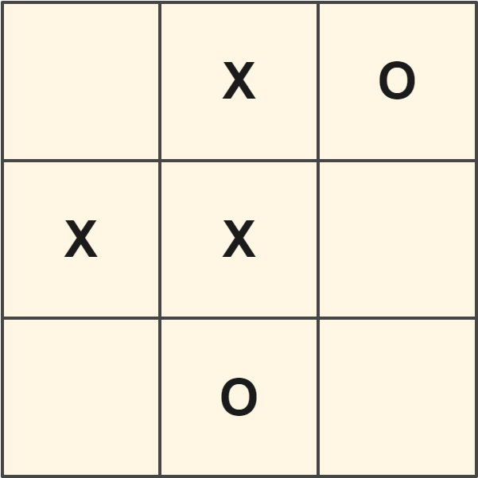
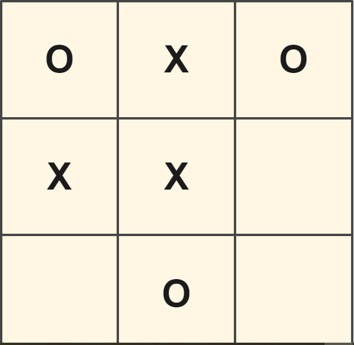
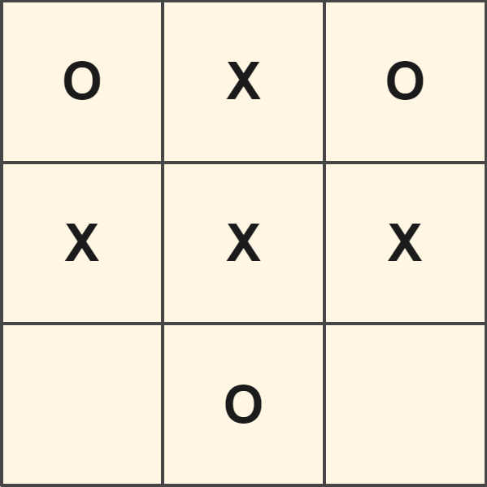
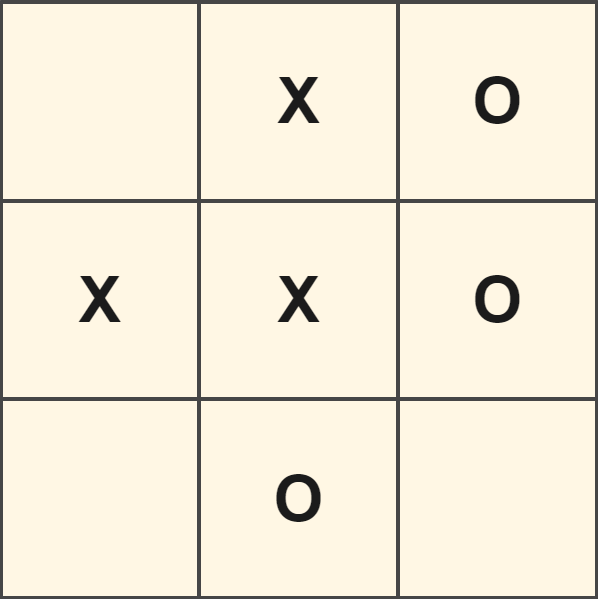
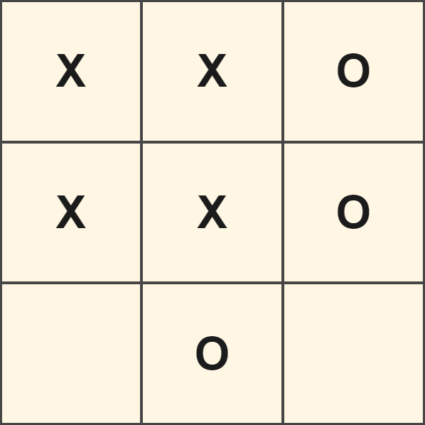
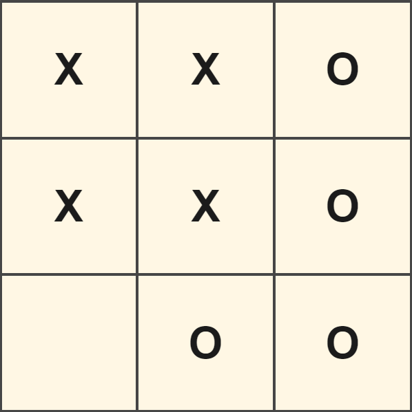
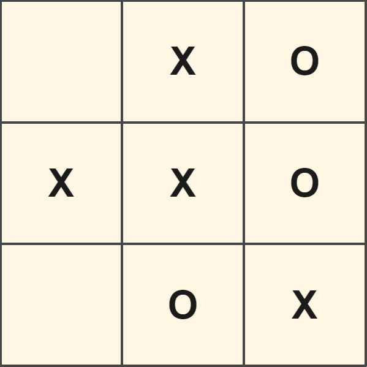
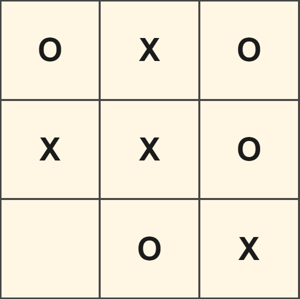

# Tic Tac Toe

## Introduction

Inspiration for this project came from [the Odin Project curriculum](https://www.theodinproject.com/lessons/node-path-javascript-tic-tac-toe). At first, I was most interested in practicing writing better code by focusing more intentionally on encapsulation -- i.e., limiting public access to an object's internal variables and methods. After building a functional version of Tic Tac Toe (albeit, a rather boring one), I decided to tackle another challenge: implement an algorithm to play Tic Tac Toe perfectly. I planned to integrate my algorithm with my original version of Tic Tac Toe, but I ended up changing some fundamental patterns that made building a new UI easier than integration. (For example, in my first version of the game I labeled the Tic Tac Toe squares 0 - 8, but in the second one I labeled the squares by rows (0 - 2) and columns (0 - 2), which I found more intuitive to work with.)

You can play the two-player game [here](https://jordanccox.github.io/tic-tac-toe/) or the one-player vs. algorithm version [here](https://jordanccox.github.io/tic-tac-toe/human-vs-computer).

## Design Patterns

Initially, I built this game to practice two object-oriented design patterns: **factory functions** and **modules**.

### Factory Functions

A factory function is a function that, when called, returns an object. In this project, I needed two player objects. I had a few tools at my disposal to accomplish this: I could have used a constructor function, a class (JavaScript syntactic sugar that makes working with constructor functions easier to grasp), or a factory function. I chose the last option (you can read about some of the benefits of factory functions over constructors [here](https://www.theodinproject.com/lessons/node-path-javascript-factory-functions-and-the-module-pattern)) and implemented it in the following way:

```
const Player = (playerName, symbol) => {
    let name = playerName;
    let token = symbol;
    let isTurn = false;

    return { name, token, isTurn };
};
```

Later in my code, when I needed to initialize instances of the Player object, I did so by typing `let player1 = Player("Player One", "X");` and `let player2 = Player("Player Two", "O");`. Now, I had two Player instances with unique `name` and `token` properties and `isTurn` properties that I could toggle to determine which player's turn it was throughout the game.

### Modules

Modules are similar to factory functions in that they are functions that return an object; however, the difference is modules will return exactly one object instance. They are implemented using an [Immediately Invoked Function Expression (IIFE)](https://developer.mozilla.org/en-US/docs/Glossary/IIFE), which means the instance of the object is created right after the function is read by the interpreter.

One of the places I used this pattern was in constructing a Gameboard object. Since there is only one gameboard, I only needed one instance of this object:

```
const Gameboard = (() => {

    const board = [];

    const WIN_CONDITIONS = [[0, 1, 2], [3, 4, 5], [6, 7, 8], [6, 4, 2], [0, 4, 8], [0, 3, 6], [1, 4, 7], [2, 5, 8]];

    const checkWinConditions = (player) => {
        // Do stuff and things here
    };

    return { board, checkWinConditions };

})();
```

The key pieces of this function are the beginning `(` and ending `)()` which wrap the contents of the function. The ending `()` is comparable to a regular function call you might use somewhere else in your code such as `myFunctionThatDoesAThing()`, except that it occurs right after the function expression, therefore executing it immediately.

## Creating the Perfect Player with a Minimax Algorithm

To create an unbeatable computer player, I used a minimax algorithm, which I learned about and implemented using code from these sources: [Minimax Algorithm in Game Theory](https://www.geeksforgeeks.org/minimax-algorithm-in-game-theory-set-1-introduction/), [Introduction to Evaluation Function of Minimax Algorithm](https://www.geeksforgeeks.org/introduction-to-evaluation-function-of-minimax-algorithm-in-game-theory/), [Finding Optimal Move in Tic-Tac-Toe using Minimax Algorithm](https://www.geeksforgeeks.org/finding-optimal-move-in-tic-tac-toe-using-minimax-algorithm-in-game-theory/).

For an in-depth video explanation of minimax, watch [Algorithms Explained - minimax and alpha-beta pruning](https://www.youtube.com/watch?v=l-hh51ncgDI) by Sebastian Lague.

### Here is my oversimplified, visual explanation of how the minimax algorithm works for Tic Tac Toe:

Imagine you have a Tic Tac Toe game that looks like this at O's turn:



To you or me, it is obvious that O has only one move (row 2, column 3) that will prevent X from winning in the next turn (assuming X doesn't make a blunder). How do you get a computer to find the best move in this situation and block X from winning?

Before answering that question, there is a more fundamental question that we have to tackle first: How do you get a computer to _want_ to win the game? This is where we have to begin -- defining what it means to win the game and assigning values to winning or losing. In Tic Tac Toe, winning is straightforward: Mark three squares in a row with X or O (either horizontally, vertically, or diaganolly). In our example (and in the script I wrote), each time a player makes a move, a function is run that evaluates the board to see if either player has three in a row. If X has three in a row, player X is rewarded with +1. If O has three in a row, player O is rewarded with -1. If neither player has three in a row, the function returns 0. Player X is a maximizer -- its objective is to increase points when it is its turn. Player O is a minimizer -- it is trying to decrease points.

Okay, let's go back to how to build an algorithm that can make the right decision -- one that will lead to it winning, or at least not losing. One way is to have the computer look through all possible outcomes of the game and determine which will have a positive outcome for it. Let's take player O's perspective. Player O is an algorithm that "wants" to get -1 by achieving three in a row. First, it plays "O" in the upper left hand corner:



Then the algorithm simulates the following turn by X:



Uh-oh, X won. O assigns this possibility a value of +1, which is not good for O. So O backtracks to where it was earlier and places an "O" on the square at row 2, column 3:



It again simulates X's next move:



For the sake of simplicity, I'm going to just describe what happens during the next few iterations: O places an "O" on row 3, column 1. X places an "X" on row 3, column 3, winning the game. O assigns this possibility a value of +1 and backtracks. It now places an "O" on row 3, column 3 and wins the game. It assigns this possibility a value of -1 -- hey, that's a good outcome for O! 



But what if X played a smarter game? The move X made on row 1, column 1 was far from optimal, so O can't bank on X making a move like that (especially if X is also an algorithm trying to find the best move for itself). O backtracks to this point to traverse that possibility:


The best move for X is row 3, column 3, blocking O's win and setting itself up for a win if O blunders its next turn.



At this point, O places an "O" at row 1, column 1:



The only possible move X has after this is row 3, column 1. This possibility ends with a draw -- O assigns this possibility a 0. Although this isn't a win for O, it isn't a win for X either, so, if it comes to losing or drawing, O will pursue the path that leads to a draw.

In summary, minimax works by creating two computer players -- a maximizer and a minimizer -- that take turns making moves in a game, assigning values to those possibilities, backtracking, making different moves, assigning values to those, backtracking again, and so on, until all possibilities are exhausted (or a defined depth has been reached[^1]).

[^1]: In chess, for example, it would take far too long for an algorithm to traverse all possibile moves. Therefore, if using a minimax algorithm for chess, you could create a bot that looks just 4 or 5 moves ahead.